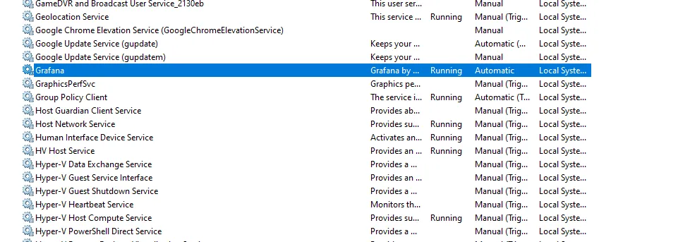
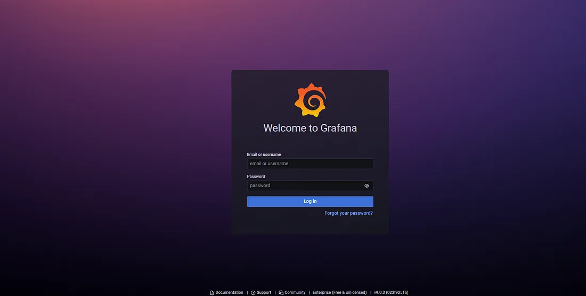
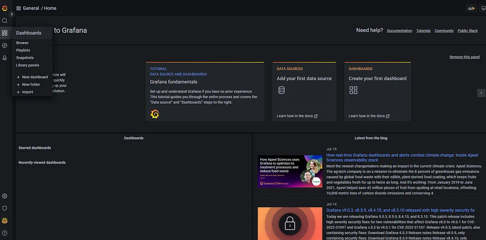
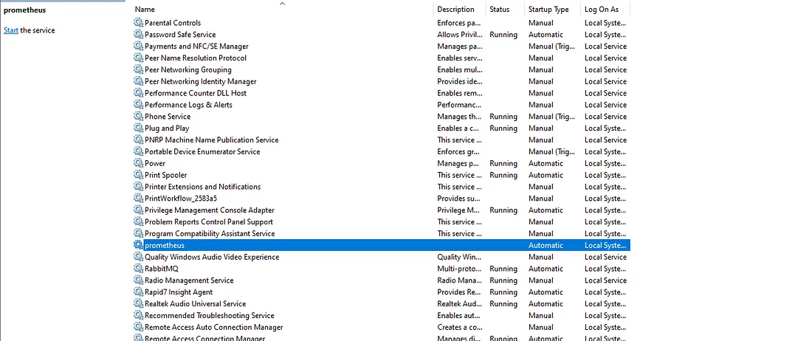
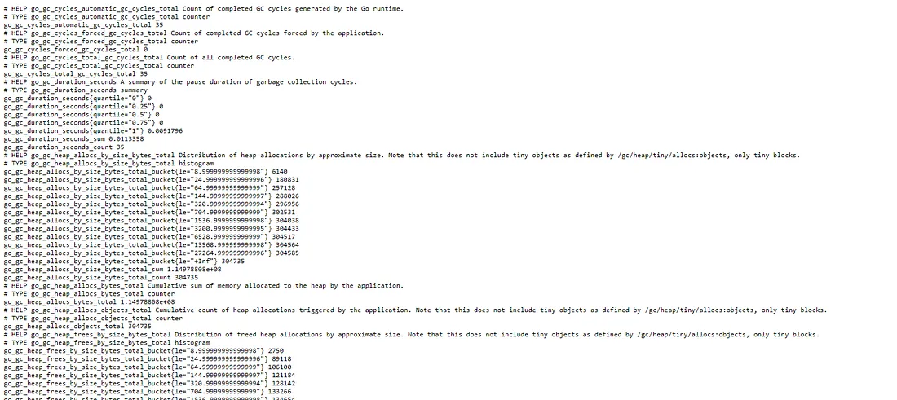
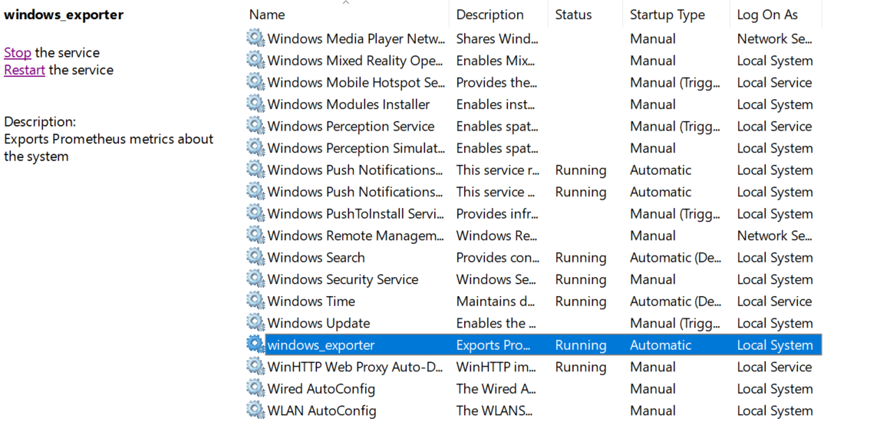
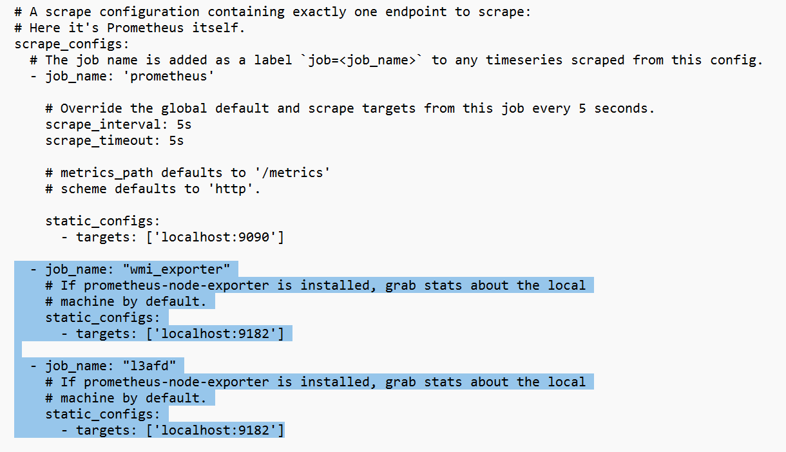
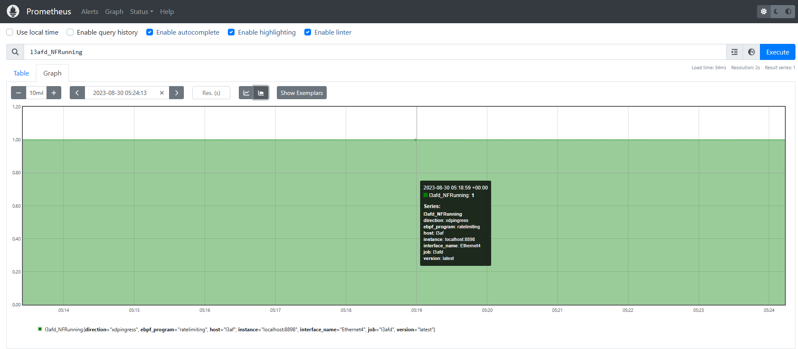
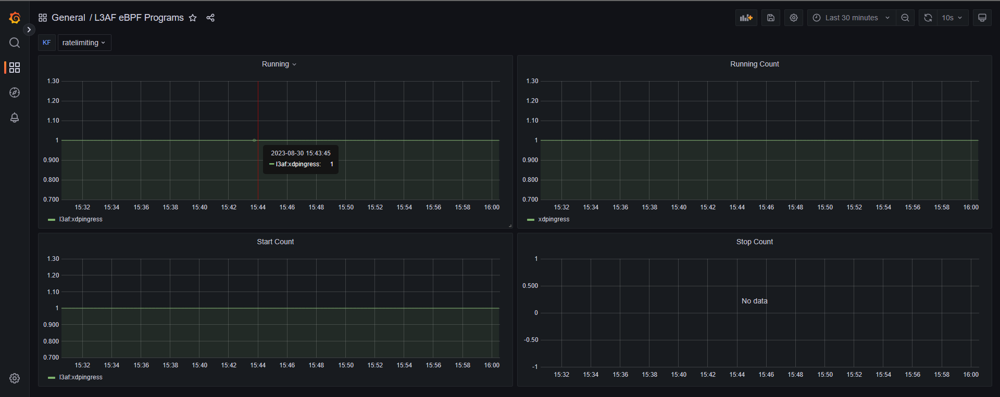

## Installing Grafana and Prometheus on Windows System

### Installation of Grafana on Windows


Navigate to https://grafana.com/grafana/download?platform=windows and Download Grafana for windows (https://dl.grafana.com/enterprise/release/grafana-enterprise-9.0.3.windows-amd64.msi)

After installation check `Grafana Service` is running



Navigate to http://localhost:3000/login

> Note: The default username and password is `admin`.





### Installation of Prometheus as Service in Windows

You can download Prometheus for windows from https://prometheus.io/download/. However, installing prometheus as a service you need to use `NSSM explorer`.

So, if you have installed Grafana first then `NSSM explorer` must be downloaded as part of Grafana. You can go to the path where Grafana is installed and can find a folder named as “**svc-9.0.3.0**”. Under this folder you can find `nssm.exe`.

If you have not installed Grafana in your system then you can install Prometheus by downloading `nssm.exe`. You can download from https://nssm.cc/download.

- Navigate the `NSSM.exe` path through command prompt
- Run Below Command:

```bash
nssm.exe install prometheus <The path where prometheus application downloaded>
```

For example:


Open `service.msc` and you can see prometheus service is installed



Before starting the prometheus service, install **WMI Exporter**:

For installing WMI Exporter, you need to download `wmi exporter` from https://github.com/prometheus-community/windows_exporter/releases/download/v0.18.1/windows_exporter-0.18.1-amd64.msi

Post installation of `wmi exporter`, you can validate by navigating to http://localhost:9182/


Click on Metrics link



You can also validate `windows_exporter` service is running:



Navigate to prometheus `config file path` and open the “**prometheus.yml**”

You need to add job for `wmi exporter` and `l3afd` , as shown below:



Now run Run Prometheus service


After starting Prometheus service, navigate to http://localhost:9090/


Now you can access Prometheus service.

You can also see `l3afd metric` graph using prometheus:



## Grafana Dashboard files by l3af:
- [Check Here](../dev_environment/cfg/grafana/dashboards/)

You can use these `json` files to create dashboard for monitoring of `eBPF programs` in `Grafana`


#### eBPF program monitoring:
